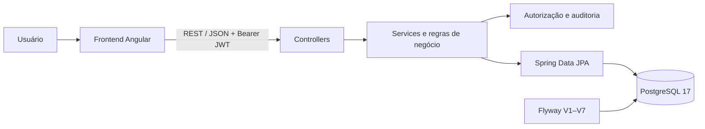

# Shared Planner — Backend API


O **Shared Planner** é uma aplicação de agenda compartilhada voltada a casais e pequenos grupos. O produto reúne calendários multiusuário, compromissos pessoais, atendimentos de clientes, eventos que dependem da aprovação de outra pessoa, controle de pagamentos, visão financeira e trilha de auditoria.

Este repositório contém a API responsável pelas regras de negócio, autenticação, autorização, persistência e evolução do banco de dados. Ele também é o **contexto implantável independente do backend** usado pelo Docker Compose do projeto. O incremento atual está sincronizado entre a cópia integrada e o standalone, com paridade oficial de 84/84 arquivos e regressão concluída nos dois contextos.

## O produto

O Shared Planner combina visibilidade compartilhada com autoria, papéis e consentimento explícitos:

- **calendários compartilhados:** cada calendário possui membros e permissões contextuais;
- **eventos `CLIENT`:** representam atendimentos, trabalho executado, valor e situação do pagamento;
- **eventos `PERSONAL`:** registram compromissos pessoais na agenda autorizada;
- **eventos `SHARED`:** solicitam a participação de outro membro e passam por aprovação ou rejeição;
- **financeiro:** consolida valores previstos, recebidos e pendentes por calendário e período;
- **administração:** gerencia usuários, calendários, membros e papéis;
- **auditoria:** registra alterações relevantes, o autor da ação e os estados anterior e posterior quando aplicável.

## Responsabilidades deste backend

| Domínio | Responsabilidade |
|---|---|
| `auth` | Login, emissão e validação de JWT e identificação do usuário autenticado |
| `user` | Cadastro, consulta, atualização, ativação e papéis globais de usuários |
| `calendar` | Criação de calendários, listagem por visibilidade e gestão de membros |
| `event` | CRUD lógico, busca, tipos de evento, aprovação e controle de pagamentos |
| `finance` | Resumos financeiros por intervalo e indicadores de recebimento |
| `audit` | Registro e consulta autorizada da trilha de alterações |
| `config` | Segurança stateless e regras centralizadas de autorização |
| `health` | Endpoint público para healthcheck da aplicação |

## Arquitetura



A aplicação separa controllers REST, serviços de domínio, autorização, repositórios JPA e entidades. O Flyway é responsável pela evolução do schema; nos perfis `dev` e `prod`, o Hibernate apenas valida a compatibilidade entre o modelo e o banco.

### Topologia multi-repositório

O projeto mantém três repositórios com históricos independentes:

| Repositório | Papel |
|---|---|
| [`shared-planner`](https://github.com/JotaP3c/shared-planner) | Contexto integrado, documentação, especificações SDD, scripts e Docker Compose |
| [`shared-planner-backend`](https://github.com/JotaP3c/shared-planner-backend) | Fonte implantável desta API e contexto real do build do backend |
| [`shared-planner-frontend`](https://github.com/JotaP3c/shared-planner-frontend) | Aplicação Angular e contexto real do build do frontend |

Na topologia local esperada, eles ficam lado a lado:

```text
C:\git\shared-planner
C:\git\shared-planner-backend
C:\git\shared-planner-frontend
```

A fonte das decisões funcionais e técnicas é a [documentação SDD do monorepo](https://github.com/JotaP3c/shared-planner/tree/main/docs/sdd). A sincronização entre a cópia integrada `shared-planner/backend` e este repositório compara caminhos relativos e hashes SHA-256, sem copiar `.git`, credenciais ou artefatos gerados.

## Stack técnica

| Camada | Tecnologia |
|---|---|
| Linguagem | Java 17 |
| Framework | Spring Boot 4.0.6 |
| API | Spring Web MVC e Bean Validation |
| Segurança | Spring Security, OAuth2 Resource Server e JWT HS256 |
| Persistência | Spring Data JPA e Hibernate |
| Banco de runtime | PostgreSQL 17 |
| Migrações | Flyway |
| Build | Maven Wrapper 3.9.15 |
| Testes | Spring Boot Test, Spring Security Test e H2 em modo PostgreSQL |
| Container | Docker multi-stage com JRE 17 |

## Estrutura do repositório

```text
.
├── src/main/java/com/sharedplanner
│   ├── audit
│   ├── auth
│   ├── calendar
│   ├── config
│   ├── event
│   ├── finance
│   ├── health
│   └── user
├── src/main/resources
│   ├── db/migration
│   ├── application.properties
│   ├── application-dev.properties
│   └── application-prod.properties
├── src/test
├── Dockerfile
├── pom.xml
└── mvnw / mvnw.cmd
```

## Permissões

Há dois níveis complementares de papel:

- **global:** `ADMIN`, `FINANCE` e `USER`;
- **por calendário:** `ADMIN`, `FINANCE`, `EDITOR` e `VIEWER`.

O comportamento atualmente implementado é:

| Ação | Global ADMIN | Calendar ADMIN | EDITOR | FINANCE | VIEWER |
|---|---:|---:|---:|---:|---:|
| Visualizar calendários e eventos | todos | sim | sim | sim | sim |
| Criar calendário | sim | não | não | não | não |
| Criar evento | sim | sim | sim | não | não |
| Editar ou cancelar evento | todos | todos do calendário | próprios | não | não |
| Consultar financeiro | todos | sim | não | sim | não |
| Gerenciar membros | todos | sim | não | não | não |
| Consultar auditoria | todos | do calendário | não | não | não |
| Aprovar ou rejeitar `SHARED` | somente se for alvo ativo e membro atual | somente se for alvo ativo e membro atual | somente se for alvo ativo e membro atual | somente se for alvo ativo e membro atual | somente se for alvo ativo e membro atual |

O papel global `FINANCE` não concede acesso irrestrito: o usuário também precisa pertencer ao calendário. Campos financeiros de eventos são omitidos para ator sem capacidade; a autorização é resolvida uma vez por request/calendar e cacheada por calendário em pendências. Atualizações de pagamento seguem a permissão CURRENT de edição do evento; a política futura permanece aberta em Q-005. O owner do calendário não pode ser removido nem rebaixado de `ADMIN`.

## Endpoints principais

Todos os endpoints, exceto health e login, exigem `Authorization: Bearer <token>`.

| Método | Endpoint | Finalidade |
|---|---|---|
| `GET` | `/api/health` | Healthcheck público |
| `POST` | `/api/auth/login` | Autenticar e obter um JWT |
| `GET` | `/api/auth/me` | Consultar o usuário autenticado |
| `GET` / `POST` | `/api/users` | Listar ou criar usuários como administrador global |
| `PUT` | `/api/users/{userId}` | Atualizar papel, nome e estado de um usuário |
| `GET` / `POST` | `/api/calendars` | Listar calendários visíveis ou criar um calendário |
| `GET` / `POST` | `/api/calendars/{calendarId}/members` | Listar ou adicionar membros |
| `PUT` / `DELETE` | `/api/calendars/{calendarId}/members/{memberId}` | Alterar papel ou remover membro |
| `GET` / `POST` | `/api/events` | Listar por intervalo ou criar eventos |
| `GET` | `/api/events/search` | Pesquisar eventos visíveis por termo |
| `GET` | `/api/events/{eventId}` | Consultar detalhes de um evento |
| `PUT` / `DELETE` | `/api/events/{eventId}` | Atualizar ou cancelar logicamente um evento |
| `GET` | `/api/events/pending-approvals` | Listar solicitações de aprovação |
| `POST` | `/api/events/{eventId}/approve` | Aprovar um evento compartilhado |
| `POST` | `/api/events/{eventId}/reject` | Rejeitar um evento compartilhado |
| `PUT` | `/api/events/{eventId}/payment` | Atualizar os dados de pagamento de um atendimento |
| `GET` | `/api/events/client-revenue` | Resumir receita de clientes por período padrão |
| `GET` | `/api/finance/summary` | Consolidar valores em um intervalo de datas |
| `GET` | `/api/audit-logs` | Consultar logs com filtros opcionais |

Os contratos completos, parâmetros, respostas e regras de status HTTP estão na [especificação de API](https://github.com/JotaP3c/shared-planner/blob/main/docs/sdd/11-api-contracts.md).

## Banco de dados e Flyway

O banco de runtime é PostgreSQL. A aplicação executa automaticamente as migrations de `src/main/resources/db/migration` antes de validar o modelo JPA:

| Versão | Alteração |
|---|---|
| V1 | Usuários, papéis, ativação e credenciais com hash |
| V2 | Calendários, membros e eventos |
| V3 | Situação, método e valores de pagamento |
| V4 | Papéis contextuais de calendário |
| V5 | Campos de autoria e atualização |
| V6 | Tabela e índices de auditoria |
| V7 | Unicidade de e-mail sem diferenciar maiúsculas e minúsculas |

Seeds de desenvolvimento não são migrations. Eles ficam na documentação do repositório de integração e devem ser executados somente de forma consciente no ambiente adequado.

## Executar a stack completa com Docker

Esta é a forma recomendada para validar o produto inteiro. Se necessário, clone os três repositórios como diretórios irmãos:

```powershell
Set-Location C:\git
git clone https://github.com/JotaP3c/shared-planner.git
git clone https://github.com/JotaP3c/shared-planner-backend.git
git clone https://github.com/JotaP3c/shared-planner-frontend.git
```

Depois, prepare somente a configuração local e suba a stack:

```powershell
Set-Location C:\git\shared-planner

if (-not (Test-Path -LiteralPath .env)) {
    Copy-Item -LiteralPath .env.example -Destination .env
}

# Substitua os placeholders do .env por valores locais fortes.
powershell -ExecutionPolicy Bypass -File .\scripts\check-repository-sync.ps1
docker compose config --quiet
docker compose up --build -d --wait
docker compose ps
```

Com as portas padrão:

- frontend: `http://localhost:4200`;
- backend: `http://localhost:8080`;
- healthcheck: `http://localhost:8080/api/health`;
- PostgreSQL: `localhost:5432`.

O Compose vincula os três serviços a `127.0.0.1` por padrão por meio de `BIND_ADDRESS`. Exposição a outra interface exige alteração consciente e não torna seeds/credenciais locais adequados a ambiente compartilhado.

O arquivo `.env` é local e ignorado pelo Git. Somente `.env.example`, com placeholders, deve ser versionado. Nunca publique senha de banco, segredo JWT, token ou credencial de usuário.

Para acompanhar somente esta API:

```powershell
docker compose logs -f backend
```

## Executar o backend localmente

### Requisitos

- JDK 17;
- PostgreSQL disponível e com o banco previamente criado;
- Docker Desktop, caso o PostgreSQL seja fornecido pela stack;
- PowerShell nos exemplos abaixo. Em Linux/macOS, use `./mvnw`.

Defina as configurações no ambiente da sessão, sem criar um arquivo versionado com segredos:

```powershell
Set-Location C:\git\shared-planner-backend

$env:SPRING_PROFILES_ACTIVE = 'dev'
$env:SPRING_DATASOURCE_URL = 'jdbc:postgresql://localhost:5432/shared_planner'
$env:SPRING_DATASOURCE_USERNAME = '<usuario-local>'
$env:SPRING_DATASOURCE_PASSWORD = '<senha-local>'
$env:APP_JWT_SECRET = '<segredo-aleatorio-com-32-ou-mais-caracteres>'
$env:APP_JWT_EXPIRATION_MINUTES = '120'

.\mvnw.cmd spring-boot:run
```

O Flyway cria ou atualiza as tabelas dentro do banco existente. A API inicia em `http://localhost:8080` por padrão.

### Variáveis do profile `prod`

| Variável | Obrigatória | Descrição |
|---|---:|---|
| `SPRING_PROFILES_ACTIVE` | sim | Use `prod` em container ou implantação |
| `SPRING_DATASOURCE_URL` | sim | URL JDBC do PostgreSQL |
| `SPRING_DATASOURCE_USERNAME` | sim | Usuário do banco |
| `SPRING_DATASOURCE_PASSWORD` | sim | Senha do banco |
| `APP_JWT_SECRET` | sim | Segredo aleatório e exclusivo para assinatura HS256 |
| `APP_JWT_EXPIRATION_MINUTES` | não | Validade do token; padrão de 120 minutos |

Os defaults não sensíveis de URL/usuário no profile `dev` existem apenas para desenvolvimento local. Senha do banco e segredo JWT não possuem fallback utilizável: devem vir do ambiente; o segredo JWT precisa ter ao menos 32 caracteres e a duração deve ser positiva.

## Uso básico da API

Healthcheck:

```powershell
Invoke-RestMethod -Method Get -Uri 'http://localhost:8080/api/health'
```

Login e chamada autenticada, usando somente placeholders locais:

```powershell
$body = @{
    email = 'usuario@exemplo.com'
    password = '<senha-local>'
} | ConvertTo-Json

$login = Invoke-RestMethod `
    -Method Post `
    -Uri 'http://localhost:8080/api/auth/login' `
    -ContentType 'application/json' `
    -Body $body

$headers = @{ Authorization = "Bearer $($login.accessToken)" }
Invoke-RestMethod -Method Get -Uri 'http://localhost:8080/api/auth/me' -Headers $headers
```

## Testes e build

O Maven Wrapper fixa a versão da ferramenta, portanto uma instalação global do Maven não é necessária.

```powershell
Set-Location C:\git\shared-planner-backend

.\mvnw.cmd clean test
.\mvnw.cmd -DskipTests package
```

Os testes automatizados usam H2 em modo de compatibilidade PostgreSQL com Flyway desabilitado para feedback rápido. O gate completo do projeto também executa a aplicação contra PostgreSQL real pela stack Docker.

O incremento de 2026-08-22 passou com 16/16 testes tanto no integrado quanto no standalone. A suíte cobre JWT ausente/adulterado/expirado/issuer incorreto e usuário inativo, BOLA, contratos sem senha/hash, owner, revogação SHARED, redação financeira sem N+1, precisão/integridade de pagamento e resumo Finance. O pacote standalone e as imagens Docker também foram construídos com sucesso; Flyway V7 e a regressão HTTP passaram no PostgreSQL real. A matriz completa de status de pagamento, concorrência, auditoria, CI/E2E e privilégios PostgreSQL continuam como gates adicionais.

O pacote gerado fica em `target/`. Esse diretório é artefato de build e não deve ser commitado.

## Imagem Docker independente

O `Dockerfile` usa duas etapas:

1. Maven com Eclipse Temurin 17 compila o JAR;
2. uma imagem JRE 17 executa a aplicação com o usuário não privilegiado `app`.

Para construir somente a imagem do backend:

```powershell
Set-Location C:\git\shared-planner-backend
docker build --tag shared-planner-backend:local .
```

O build da imagem não executa os testes; rode `mvnw.cmd clean test` como gate antes de publicá-la. A execução integrada e a rede com PostgreSQL são responsabilidade do [`compose.yaml`](https://github.com/JotaP3c/shared-planner/blob/main/compose.yaml) do monorepo.

## Segurança

- autenticação stateless com JWT HS256, expiração, issuer `shared-planner-api` e usuário ativo validados;
- senhas persistidas como hash BCrypt;
- apenas `GET /api/health` e `POST /api/auth/login` são públicos;
- autorização aplicada no backend, independentemente do que a interface exibe;
- usuários inativos não autenticam;
- eventos omitem os cinco campos financeiros sem capacidade; a resolução por request/calendar evita N+1;
- membership atual é revalidada na fila e nas decisões SHARED;
- owner não pode ser removido nem rebaixado;
- segredo JWT é externo e validado com mínimo de 32 caracteres; não há fallback dev conhecido;
- cancelamentos preservam o evento como `CANCELLED` para manter rastreabilidade;
- ações de usuários, calendários, membros, eventos, aprovações e pagamentos geram auditoria;
- `.env`, logs, tokens e artefatos locais estão excluídos do versionamento e do contexto Docker.

Para ambientes reais, gere um `APP_JWT_SECRET` aleatório e exclusivo, use credenciais próprias do ambiente, restrinja o acesso ao PostgreSQL e trate os registros de auditoria como dados potencialmente pessoais e financeiros.

## Fluxo de desenvolvimento

O projeto adota **Spec-Driven Development**:

1. atualizar ou confirmar a especificação no monorepo;
2. implementar com o contexto integrado de backend e frontend;
3. revisar o preview e sincronizar os repositórios standalone;
4. validar a paridade por caminho e SHA-256;
5. executar testes, build do backend e stack completa;
6. criar commits independentes em cada repositório afetado.

Referências:

- [Visão do produto](https://github.com/JotaP3c/shared-planner/blob/main/docs/sdd/00-product-vision.md)
- [Regras de negócio](https://github.com/JotaP3c/shared-planner/blob/main/docs/sdd/03-business-rules.md)
- [Matriz de permissões](https://github.com/JotaP3c/shared-planner/blob/main/docs/sdd/04-permissions.md)
- [Contratos da API](https://github.com/JotaP3c/shared-planner/blob/main/docs/sdd/11-api-contracts.md)
- [Modelo de dados](https://github.com/JotaP3c/shared-planner/blob/main/docs/sdd/12-data-model.md)
- [Estratégia de testes](https://github.com/JotaP3c/shared-planner/blob/main/docs/sdd/16-test-strategy.md)
- [Documentação Docker](https://github.com/JotaP3c/shared-planner/tree/main/docker)
