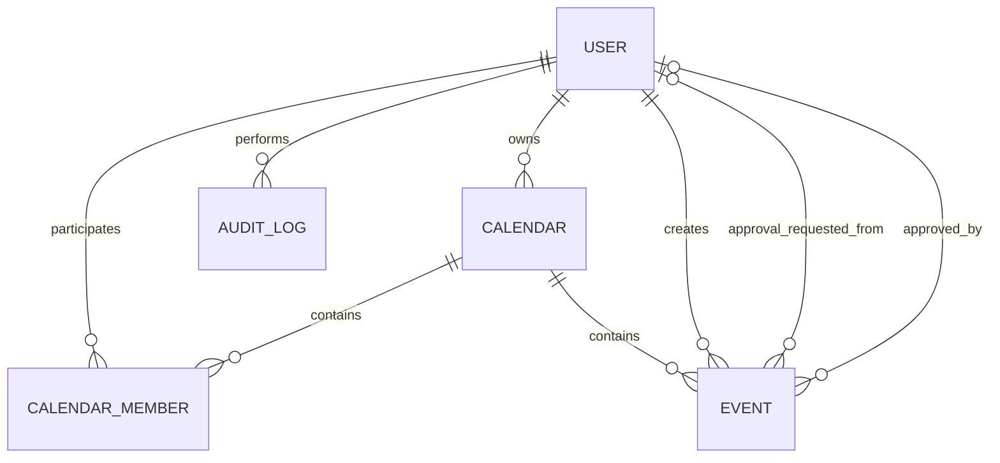

# 02 — Modelo de domínio

## Entidades reais

- `User`: identidade global, e-mail único, senha BCrypt, papel global, ativo e autoria administrativa.
- `SharedCalendar`: agenda nomeada, com `owner`; criação é atualmente exclusiva de ADMIN global.
- `CalendarMember`: vínculo único usuário–calendário e papel contextual.
- `Event`: agregado para `CLIENT`, `PERSONAL` e `SHARED`, incluindo aprovação e campos financeiros.
- `AuditLog`: registro imutável de ação, entidade, calendário opcional, ator, data e snapshots textuais.
- Pagamento não é entidade: é estado embutido em `Event`.

Enums persistidos como texto: `UserRole`, `CalendarMemberRole`, `EventType`, `EventStatus`, `PaymentStatus`, `PaymentMethod`, `AuditEntityType`, `AuditAction`. Evidência: entidades Java e migrations em `backend/src/main/resources/db/migration`.

## Invariantes

CURRENT: fim após início; valor não negativo; campos específicos são validados no serviço; membro é único por calendário/usuário; dono não pode ser removido via API. TARGET mantém essas invariantes e exige esclarecer autoria versus pessoa responsável (Q-001/Q-002).
