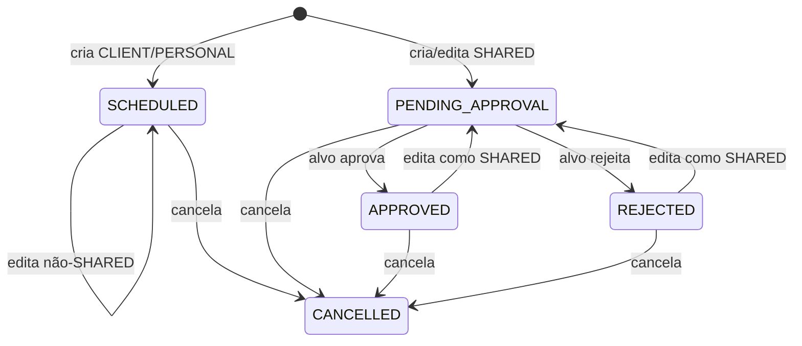

# 08 — Evento SHARED

Objetivo: obter consentimento de outro membro para compromisso conjunto.

Pré-condições: criador pode criar no calendário; alvo informado, ativo, membro e diferente do solicitante. Criação produz `PENDING_APPROVAL`. Só `approvalRequestedFrom` pode aprovar/rejeitar; status deve estar pendente.

`CANCELLED` é terminal para edição, pagamento e novo cancelamento. O alvo só permanece apto a listar, aprovar ou rejeitar enquanto for usuário ativo e membro atual do calendário; remover o vínculo revoga imediatamente essas ações sem apagar o evento pendente. Alvo SHARED com papel ADMIN/EDITOR ainda pode editar o evento inteiro antes do cancelamento. TARGET exige decidir se edição reinicia aprovação e quem pode editar (Q-004).

UI CURRENT: fila `/pending`, painel no calendário e detalhe permitem aprovar/rejeitar. Critérios: AC-SHARED-001–005. Evidência: `EventRepository.findPendingApprovalsForCurrentMember`, `EventService.ensureApprovalTarget`, `update`, `PendingPage` e regressão de alvo removido em `ApiSecurityIntegrationTests`.
