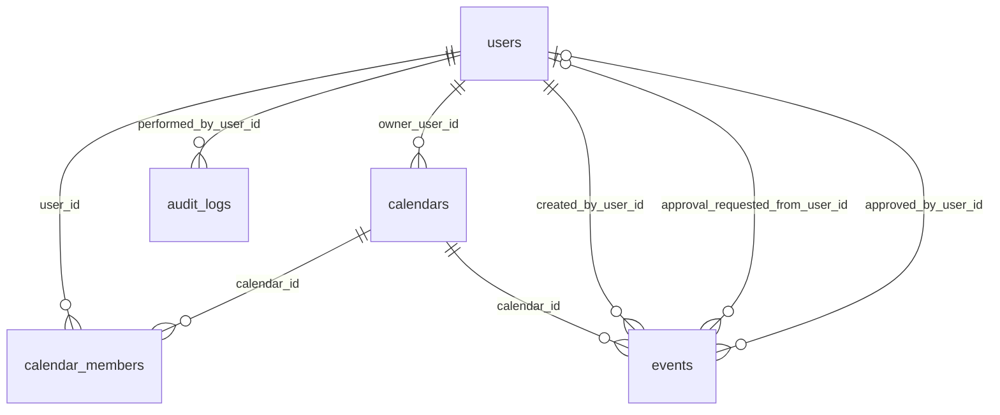

# 12 — Modelo de dados

| Tabela | PK/FKs | Campos e constraints relevantes |
|---|---|---|
| `users` | UUID; self-FKs created/updated by | email obrigatório e único por `lower(email)`, nome, hash, role, active, timestamps |
| `calendars` | UUID; owner/created/updated → users | nome obrigatório, owner obrigatório |
| `calendar_members` | UUID; calendar/user/audit users | UNIQUE(calendar,user), role default VIEWER após V4; cascade ao excluir calendário |
| `events` | UUID; calendar/users | tipo/status/título; dados cliente/pessoa; `ends_at>starts_at`; amount e received >=0; campos pagamento; cascade com calendário |
| `audit_logs` | UUID; performed_by → users | entidade/ação/sumário/ator/data; old/new; índices entidade, calendário+data e data |

Migrations PostgreSQL: V1 usuários; V2 calendário/membros/eventos; V3 pagamento; V4 converte OWNER→ADMIN e MEMBER→VIEWER; V5 autoria; V6 auditoria; V7 substitui a unicidade case-sensitive por `uk_users_email_ci` em `lower(email)`. Enums não possuem CHECK constraints no banco, logo integridade depende da aplicação. Regras CLIENT/PERSONAL/SHARED e consistência de pagamento também não são constraints SQL.

Seeds em `docs/database` são auxiliares de desenvolvimento, não migrations. Eles não foram reaplicados diretamente ao PostgreSQL TARGET; os dados existentes no SQL Server legado foram transferidos de forma controlada e preservam as identidades originalmente criadas por esses seeds. Evidência: `backend/src/main/resources/db/migration/V1...V7`, entidades JPA e [28](28-postgresql-data-transfer-plan.md).
