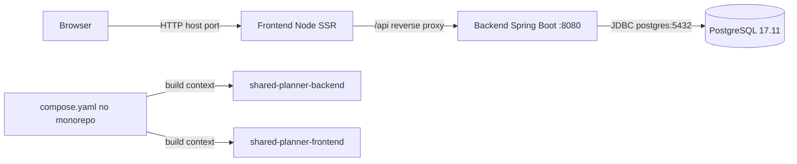

# 23 — Containerization Specification

## Objetivo

Executar PostgreSQL, backend e frontend como uma stack local reproduzível. O Compose pertence ao repositório de integração, porém os artefatos implantáveis são construídos exclusivamente dos repositórios standalone sincronizados.

## Arquitetura



Angular gera `server.mjs`; o runtime frontend é Node SSR. O servidor encaminha `/api` ao backend interno, enquanto o navegador permanece na origem pública do frontend.

## Fontes de build

```text
Backend Dockerfile:
C:\git\shared-planner-backend\Dockerfile

Frontend Dockerfile:
C:\git\shared-planner-frontend\Dockerfile

Compose orchestrator:
C:\git\shared-planner\compose.yaml
```

Os diretórios `C:\git\shared-planner\backend` e `C:\git\shared-planner\frontend` permanecem para análise integrada, mas não são contextos finais de build.

## Regras

- INFRA-DOCKER-001: o backend standalone deve possuir Dockerfile multi-stage independente.
- INFRA-DOCKER-002: o frontend standalone deve possuir Dockerfile multi-stage independente.
- INFRA-DOCKER-003: cada imagem deve ser construível na raiz de seu próprio repositório, sem fontes do outro componente.
- INFRA-DOCKER-004: Compose deve usar os repositórios standalone, nunca as cópias `./backend` e `./frontend` do monorepo.
- INFRA-DOCKER-005: os contextos devem aceitar configuração por `.env`, mantendo defaults sibling seguros.
- INFRA-DOCKER-006: `docker compose up --build` deve iniciar PostgreSQL, backend e frontend.
- INFRA-DOCKER-007: PostgreSQL, backend e frontend devem possuir healthchecks; dependências aguardam saúde.
- INFRA-DOCKER-008: volume nomeado deve persistir PostgreSQL; `down` não pode apagar os dados.
- INFRA-DOCKER-009: segredos de runtime devem vir do ambiente e não de Dockerfile, imagem ou documentação versionada.
- INFRA-DOCKER-010: a paridade dos repositórios deve ser verificada antes do build final.

## Contextos configuráveis

```yaml
backend:
  build:
    context: ${BACKEND_BUILD_CONTEXT:-../shared-planner-backend}
    dockerfile: Dockerfile

frontend:
  build:
    context: ${FRONTEND_BUILD_CONTEXT:-../shared-planner-frontend}
    dockerfile: Dockerfile
```

Os caminhos relativos são resolvidos a partir de `C:\git\shared-planner\compose.yaml`. `.env.example` documenta defaults; `.env` local pode sobrescrevê-los e não deve ser versionado.

## Builds independentes

```powershell
Set-Location C:\git\shared-planner-backend
docker build -t shared-planner-backend .

Set-Location C:\git\shared-planner-frontend
docker build -t shared-planner-frontend .
```

Backend: Maven/Java 17 no build, JRE 17 no runtime, usuário sem privilégio, porta 8080 e Flyway V1–V7 antes da validação Hibernate. Frontend: Node 24, `npm ci`, build Angular SSR, usuário sem privilégio e porta interna 4000.

## PostgreSQL e rede

O serviço `postgres` usa PostgreSQL 17, porta interna 5432 e volume `postgres_data`. Backend usa o host Docker `postgres`; clientes no Windows, incluindo DBeaver, usam `localhost` e a porta publicada definida por `POSTGRES_PORT`.

## Gate de validação

Primeiro valide a sintaxe sem imprimir valores interpolados e projete somente os contextos de build:

```powershell
docker compose config --quiet
$cfg = docker compose config --format json | ConvertFrom-Json
[pscustomobject]@{
    BackendBuildContext = $cfg.services.backend.build.context
    FrontendBuildContext = $cfg.services.frontend.build.context
}
Remove-Variable cfg
```

Nunca imprima a configuração bruta, pois ela contém variáveis sensíveis interpoladas.

## Evidência final

| Gate | Resultado | Evidência |
|---|---|---|
| Contexto backend | PASS | `C:\git\shared-planner-backend` |
| Contexto frontend | PASS | `C:\git\shared-planner-frontend` |
| Build backend standalone | PASS | imagem construída; prefixo de digest informado `sha256:285f…` |
| Build frontend standalone | PASS | imagem construída; prefixo de digest informado `sha256:d813…` |
| Compose rebuild backend | PASS | imagem usada pelo container igual à tag; prefixo `sha256:414baffe…` |
| Compose rebuild frontend | PASS | imagem usada pelo container igual à tag; prefixo `sha256:836af4b7…` |
| Stack | PASS | PostgreSQL, backend e frontend `healthy` |
| Health | PASS | backend direto e proxy frontend retornaram HTTP 200 |
| PostgreSQL | PASS | 17.11, Flyway V1–V7 e 0 FKs órfãs |
| Persistência | PASS | volume `shared-planner_postgres_data` preservou 6/4/10/11/11 após `down`/`up` sem `-v` |
| Aplicação | PASS | login API 6/6, regressão API e Edge headless |

Na estabilização inicial, `docker compose up --build -d --wait` foi repetido a partir dos HEADs standalone então commitados; os dois rebuilds passaram e os três serviços voltaram `healthy`. Naquele gate histórico, o build SSR tinha três warnings conhecidos de budget SCSS e o `npm audit` reportava 28 ocorrências. Após o incremento de 2026-08-22, a stack foi novamente reconstruída a partir dos standalones sincronizados: três serviços permaneceram `healthy`, o build passou com quatro warnings e os audits runtime/completo retornaram zero vulnerabilidades. O commit documental da integração é reportado no handoff porque não pode autorreferenciar-se.
